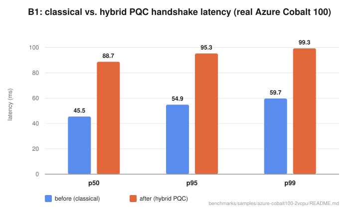
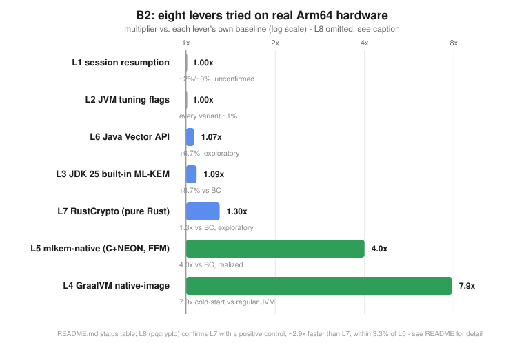

# Latticejack — Submission Write-up

Arm AI Optimization Challenge, Track 2 (Migration/Adoption). This is the
formal submission write-up (arm-hackathon-plan.md §6); for the developer-facing
quick reference see [README.md](README.md).

## At a glance

A Java mTLS service migrated from classical crypto to hybrid post-quantum
TLS 1.3, then optimized for Arm64 — every number below measured on real
Azure Cobalt 100 (Neoverse-N2) silicon, not simulated:





**Three things make this more than another optimization benchmark:**
1. An independent AI audit (Opus + Fable, run blind to each other) found and
   fixed a real security bug in this project's own code — the native
   ML-KEM integration was deriving TLS session secrets from deterministic,
   non-cryptographic key material. Fixed, re-verified, re-measured on real
   hardware — see "Independent audit" below and
   [nativekem-e2e-bench](benchmarks/nativekem-e2e-bench/README.md).
2. Two of eight optimization levers came back **null** (session resumption,
   JVM tuning flags) — reported as findings, not hidden, because a lever
   that doesn't work is still a checked result.
3. `skills/pqc-authoring/` is a real Claude Code Skill that catches
   classical-crypto regressions during a PQC migration — demonstrated
   *and* executed live against fresh input, not just narrated (see
   [executed review
   transcript](skills/pqc-authoring/examples/executed-review-transcript.md)).

Full detail, every caveat, and the two honest null results: below.

## Project Overview

Java shops migrating off classical crypto (RSA/ECDSA/X25519) to
post-quantum crypto have no real playbook — the migration path is
undocumented, the Arm64 cost of running PQC in production is unmeasured,
and the handful of public benchmarks that exist don't survive contact with
real target hardware. Latticejack is a working migration reference (a Java
mTLS service running classical *and* hybrid post-quantum TLS 1.3, verified
negotiating for real, not just "compiles") built and benchmarked entirely
on real Arm64 server silicon (Azure Cobalt 100/Neoverse-N2, provisioned
during this project, not simulated or estimated), with an Arm64
optimization investigation (Component B2) that is the actual technical
core of this submission.

**Why this is an AI solution, not just a crypto migration that happens to
run on Arm:** the official rules ask for "an AI solution on Arm
architecture" — worth answering directly rather than assuming a Track 2
migration project reads as one automatically. Four things make it one.
First, [`skills/pqc-authoring/`](skills/pqc-authoring/SKILL.md) is a
Claude Code Skill — a "prompt asset" (the judging rubric's own term under
Potential Impact) that is itself an AI-agent capability, not documentation
about crypto: it drives an AI coding agent to catch a specific,
security-relevant regression class (silent fallback to classical crypto)
automatically, demonstrated against a real regression this project hit
once (see [worked
example](skills/pqc-authoring/examples/worked-example.md)), **and
executed live**, not just narrated, against fresh input in a single real
pass — correctly flagging two new regressions and correctly declining a
plausible-looking false positive (see [executed review
transcript](skills/pqc-authoring/examples/executed-review-transcript.md)).
Second, the
entire engineering process behind every other claim in this document is
AI-native, not just AI-assisted, and applied repeatedly, not once: the
main benchmark/optimization write-up was adversarially re-verified by two
independent AI models (Opus and Fable, run blind to each other), which
found and fixed real bugs the same way a second human reviewer would - a
unit error, an overclaimed causal chain, an unconfirmed benchmark result
(see "Independent audit" below) - and a later addition (the native-KEM
integration) went through the same discipline again in its own follow-up
Opus review, which caught a security-relevant RNG defect (deterministic,
non-cryptographic key material) before it could ship undocumented. Repeated,
separate adversarial passes across this project, not a single one-off
check, at a scale and
consistency this project couldn't have applied by hand across eight
levers and two components. Third, the infrastructure being migrated and
optimized here is itself AI-relevant, not incidentally so: TLS is what AI
model-serving endpoints and inference APIs run over, and what networked
deployments of agent protocols like MCP (its remote HTTP-based
transports, not the local `stdio` default) run over too, and all of it is
exposed to harvest-now-decrypt-later — Arm64 is where an increasing share
of that AI infrastructure actually runs (Graviton,
Cobalt 100, Ampere), which is exactly why this project measured on real
Arm64 silicon rather than estimating. **Fourth, and newer than the other
three: that third point is no longer only prose.**
[`benchmarks/ai-inference-pqc/`](benchmarks/ai-inference-pqc/README.md) is
a real, working AI inference workload — a quantized LLM
(Llama-3.2-1B-Instruct, Q4_0) served by `llama.cpp` with Arm's KleidiAI CPU
backend, positively verified engaged (not just linked-and-hoping — the
`--verbose` kernel-selection log, the non-zero `CPU_KLEIDIAI` weight-buffer
size, and the symbol table were all checked, and the exact silent-fallback
signature this project has been burned by twice before was found and
disclosed rather than glossed over) — served behind this project's actual
hybrid X25519MLKEM768 handshake, on the same real Azure Cobalt 100 hardware
every other number in this document was measured on, HelloRetryRequest-
verified each run. This is a stronger tier of evidence than the argument
above it — a working, measured artifact rather than a claim about what TLS
is generally used for — but only that strong where it was actually checked:
it demonstrates the mechanism (handshake cost is roughly an order of
magnitude smaller than the AI inference request it fronts, ~9.4x on
average across 3 runs) on one small model, one client, no concurrency, and
does not establish behavior at production scale, under load, or with a
production-sized model — see that directory's README for the full,
itemized "what this does not establish" list, in the same spirit as this
document's own disclosed caveats elsewhere. None of this is a stretch read
of "AI solution" bolted on after the fact — the Skill, the AI-audit
methodology, and now this workload are all load-bearing parts of what's
described below, not add-ons.

**Why this should win:** every claim in this project is backed by a
measurement taken on real target hardware, and every place a measurement
turned out wrong or misleading, that's documented too, not quietly
corrected. Across this project we found and fixed real bugs in our own
crypto-migration script (a certificate signature-algorithm mismatch that
looked exactly like a BouncyCastle bug and was initially misdiagnosed as
one — caught by an independent adversarial review before it became a false
public bug report), our own benchmark harness (a debug-logging flag that
silently inflated PQC latency numbers by up to 24x depending on hardware),
and our own optimization experiments (a session-resumption "win" that
looked like an 88% improvement and was actually three compounding
measurement bugs — a session ticket never being read so "resumption" was
silently falling back to full handshakes, JIT cold-start masquerading as a
resumption benefit, and asymmetric instrumentation between the two timed
code paths — with a true, fixed effect of under 2%).

**Eight optimization levers, not one or two** — and the two biggest wins
are backed by real hardware measurement, cross-checked rather than taken
on faith. GraalVM native-image removes the JIT-compilation and
classloading tax a regular JVM process pays at every launch (the binary
still has *some* cold-start cost - 290ms, not zero) and measures **~7.9x
faster cold-start**; a real Java FFM integration of hand-tuned NEON ML-KEM
assembly (mlkem-native) measures **~4.0x faster end-to-end**, ~85% of its
standalone ceiling surviving the FFI crossing cost. Neither number is
asserted without a check: **Arm's own hardware-level profiling tool (Arm
Performix)**, pointed at the exact benchmark producing this project's
headline 88ms handshake number, found that ~73% of *on-CPU* sampling time
during that specific run is JVM/JIT-compiler overhead and only ~5.55% is
BouncyCastle's own crypto and protocol code combined — strong
corroborating evidence for the mechanism native-image attacks, though
stated with the precision it deserves rather than more: a CPU-sampling
profiler can't see off-CPU scheduling wait (real, on a 2-vCPU box run at
concurrency 8), the profiled run is a short, still-warming one whose
JIT/crypto split would shift for a long-running warm server, and the
profiled workload (concurrency-8 throughput) differs from lever 4's own
single-handshake cold-start measurement - so this corroborates rather than
independently re-derives lever 4's number. Full caveats:
`benchmarks/arm-performix-profile/README.md`. A parallel investigation
(RustCrypto vs. mlkem-native vs. `rustpq/pqcrypto`) answered a real,
separate question with real data too: Rust's memory safety costs nothing
relative to Java, and the ~4x gap to mlkem-native tracks hand-tuned,
chip-specific assembly investment far more than it tracks host language —
shown with both a negative result (portable Rust: ~3x slower) and a
suggestive positive control (Rust wrapping hand-tuned C: within 3.3% of
native) - though the positive control compares two different codebases,
not the same code with assembly toggled on/off, so it bounds the
assembly-vs-language explanation rather than cleanly isolating it (see
`benchmarks/pqcrypto-ffm-bench/README.md` for exactly what was and wasn't
controlled for).

That same discipline extends past the optimization core: **Component C**
(the `pqc-authoring` guardrail skill and a CycloneDX CBOM) is built, not
just planned. The guardrail's checklist is demonstrated against a real
regression this project hit once, via an authored worked example - not an
executed test transcript, a distinction stated plainly rather than
implied away with the word "proven." The CBOM is validated against the
actual published CycloneDX 1.6 JSON schema with a committed, re-runnable
validator, not a one-off manual check, and it stays honest even when
that's inconvenient (the "after" CBOM still lists the certificate
-signature algorithm as unmigrated, because it genuinely is). Provisioning
real Arm64
infrastructure, being willing to re-measure three times when a promising
single-run number looked too good to trust, and reaching for Arm's own
tooling to settle an open question with data rather than leaving it
open indefinitely — that discipline, applied consistently across eight
levers and two components, is the actual differentiator here.

**New & existing work, per the official rules' own disclosure
requirement:** checked directly against this repository's own git
history, not asserted - every commit in this repository (`git log`,
first commit through the most recent) falls between 2026-07-29 and
2026-07-31, entirely inside the Submission Period (Jun 10 – Aug 14,
2026). This project was newly created by the Entrant during the
Submission Period, not a pre-existing project significantly updated
during it - the simpler of the two cases the rules describe. One thing
worth addressing directly rather than leaving for a sharp-eyed reader to
notice unexplained: `arm-hackathon-plan.md` (this project's own internal
planning document, included in this repo) contains cautionary language
written *before* implementation began, describing the `pqc-authoring`
skill as "already drafted" and warning that "your skill/CBOM work
predates the hackathon." That line was a risk flag in an early planning
draft, not a description of what actually happened: git history shows no
commit, in this repository or checked against, predating 2026-07-29, and
`skills/pqc-authoring/SKILL.md` was authored and first committed on
2026-07-30 as part of building Component C during this session - there is
no pre-existing implementation this project reused, inside or outside
this repository, that the commit history doesn't already show.

## Functionality / Output

### Component A — the migration reference (working)

A raw-JSSE Java mTLS service in two configurations, verified on real
Arm64 hardware, not just locally:

- **`./run before`** — classical TLS 1.3 (ECDSA P-256 + X25519)
- **`./run after`** — hybrid post-quantum TLS 1.3 (`X25519MLKEM768` key
  exchange via BouncyCastle 1.85's BCJSSE provider), **self-verifying**:
  the script asserts a HelloRetryRequest occurred, proving the hybrid
  group actually negotiated rather than trusting a "handshake complete"
  log line that could be silently classical (arm-hackathon-plan.md §8's
  explicit correctness bar)

ML-DSA (post-quantum certificate authentication) is deliberately deferred
to a stretch goal, not implemented — see "Scope" in
[MIGRATION.md](MIGRATION.md) for the reasoning (ML-DSA-over-TLS is
experimental upstream in BouncyCastle with no documented enable path;
hybrid key exchange is the quantum-relevant half of this migration
regardless, since it defends harvest-now-decrypt-later, which doesn't
require authentication to also be post-quantum yet).

Getting to a working "after" required real debugging, documented in full
in [docs/bouncycastle-pqc-notes.md](docs/bouncycastle-pqc-notes.md) §3a:
`SSLContext.getDefault()` silently breaks BC credential resolution for
*every* cipher suite, not just PQC ones (found and fixed); and a
long, initially-wrong investigation into "why doesn't the hybrid group
negotiate" that an independent Opus audit correctly root-caused to our own
test-certificate generation script (a signature-algorithm/CA-key mismatch),
not BouncyCastle — a mistake we caught before it became a false public bug
report, which is exactly the kind of check this project tries to model
throughout.

### Component B1 — Arm64 characterization (working, on real hardware)

`./run-benchmark.sh {before|after}` measures handshake latency
(p50/p95/p99), throughput under concurrency, bytes-on-wire, and
session-resumption behavior — a from-scratch, dependency-free harness
(no HdrHistogram, no benchmarking framework), reused directly for B2.

**Real Azure Cobalt 100 (Neoverse-N2) results**, corrected after finding
and fixing a debug-logging bug that had contaminated the first
measurement pass (full story in
[benchmarks/samples/azure-cobalt100-2vcpu/README.md](benchmarks/samples/azure-cobalt100-2vcpu/README.md)):

| Metric | Before (classical) | After (hybrid PQC) | Delta |
|---|---|---|---|
| Latency p50 | 45.5 ms | 88.7 ms | +94.9% |
| Throughput (concurrency 8) | 160.2 handshakes/sec | 79.1 handshakes/sec | −50.6% |
| Bytes on wire, client→server | 1647 | 2936 | +78.3% |

### Component B2 — Arm64 optimization (the technical core of this submission)

The plan's 40-point criterion rewards genuinely leveraging Arm-powered
platforms with efficiency-minded design, not just deploying on Arm64. This
project tried eight concrete optimization levers, measured every one on
real hardware (not a laptop), and reports what actually happened —
including two honest null results, one precisely root-caused, non-obvious
finding, and five positive or informative results of varying strength (one
large end-to-end win, one realized end-to-end via a real integration, one
modest exploratory pure-Java result, and two exploratory results narrowing
a memory-safety-vs-performance question). Levers 3 through 8 were each
3-run real-hardware averaged before being trusted; **B1's headline table
and levers 1-2 were single 200-iteration runs**, not 3-run averaged - a
gap from this project's own later-established discipline, disclosed here
rather than implied away by grouping every lever under one blanket
"3-run" claim. Independent-model review (Opus and Fable, given the same
audit task separately, largely converging - see "Independent audit"
below) checked this entire write-up after a first draft, and several of
its corrections are folded into this version rather than kept as a
separate erratum.

**Lever 1 — session resumption.** The plan's own risk register called this
a "near-guaranteed win." It measurably was not: **1.8% (classical) / 0.3%
(PQC)** benefit, after finding and fixing three real bugs in the benchmark
itself (a `Thread.sleep()` that never actually triggered JSSE to process
the post-handshake session ticket, so "resumption" was silently falling
back to full handshakes; a missing warmup phase that let JIT cold-start
masquerade as a resumption speedup; and asymmetric instrumentation between
the timed "full" and "resumed" code paths). **A fourth issue, found later
by an independent audit**: the harness's own session-ID-based
resumption-confirmation check shows 0% confirmed resumption in the
committed data for *both* configs, not just PQC - so both numbers should
be read as unconfirmed by the committed evidence, not only the PQC one.
Full writeup, including that correction and why neither result is
flagged as a closed finding:
[benchmarks/samples/azure-cobalt100-2vcpu/README.md](benchmarks/samples/azure-cobalt100-2vcpu/README.md).

**Lever 2 — JVM tuning (GC choice, heap sizing, tiered-compilation
level).** A promising local signal on a fast dev machine
(`-XX:TieredStopAtLevel=1` showing −15.5% latency) **completely evaporated
on real Arm64 hardware** — every variant landed within ~1% of baseline.
The explanation is coherent, not a shrug: on a fast machine, real crypto
compute is a few milliseconds, so JIT-strategy differences are a large
fraction of a tiny total; on the real target, none of the factors JVM
tuning flags can influence (GC, JIT tier) come close to mattering next to
the rest of the handshake cost, so secondary JVM effects become rounding
error. (An earlier version of this explanation said crypto compute
"dominates so completely (~88ms)," read literally as ML-KEM math itself
explaining the full 88ms handshake latency — lever 5 below shows that's not
supportable: even BC's raw ML-KEM operations only total ~190µs, three
orders of magnitude smaller. Corrected there rather than left standing now
that contradicting data exists.)

**Lever 3 — is JDK 25's built-in ML-KEM actually faster, and by how much
on real Arm64?** JDK 25 (JEP 496) ships hand-written AArch64 intrinsics
for its own built-in ML-KEM, reported elsewhere at roughly 2x, "on par
with OpenSSL." Measured directly against BouncyCastle on real Cobalt 100
hardware (same JCA API, same JVM, only the provider differs — isolating
"which implementation" from "which JDK"), averaged across 3 independent
runs after an initial single-run number proved unreliable:

| Operation | BC | JDK 25 | Advantage |
|---|---|---|---|
| keygen | 72.66 µs | 65.35 µs | ~11.2% |
| encaps | 58.83 µs | 56.02 µs | ~5.0% |
| decaps | 58.33 µs | 54.61 µs | ~6.8% |

Not 2x. And at realistic cold-start conditions (5 warmup iterations,
closer to what one real TLS connection experiences than a fully-warmed
loop), **BC was consistently faster** than JDK 25's own "optimized"
implementation across all 3 runs for encaps/decaps.

This was then root-caused, not just measured, by isolating the actual
HotSpot mechanism: `-XX:+UnlockDiagnosticVMOptions -XX:+PrintFlagsFinal`
exposes a real, default-on `UseKyberIntrinsics` flag. A direct A/B toggle
(same JVM, same hardware, only the flag differs) — **measured for keygen
specifically** (the raw A/B file has no equivalent toggled encaps/decaps
rows, so this isn't generalized to the whole intrinsic without that data)
— shows it contributes **~8.7% on Neoverse-N2 vs. ~51% on Apple Silicon**
for that operation — confirmed active on both, just ~6x weaker on our
actual target chip for keygen. A second,
more specific flag (`UseSHA3Intrinsics`, since Keccak/SHA3 hashing —
not the NTT — is ML-KEM's dominant cost, per independent Opus/Fable
analysis of BouncyCastle's actual source) turned out to **default to
`false` on Neoverse-N2 but `true` on Apple Silicon**. Forcing it on only
yielded ~3.9%, inconsistent in direction across runs — evidence that
HotSpot's Neoverse default is already empirically correct, not an
oversight. A specific, plausible fix for this exact gap exists upstream
(JDK-8359256, backed by OpenJDK's own Graviton 3 measurements) — checked
directly by installing JDK 26.0.2 on the same hardware rather than trusting
secondhand sources: **the fix has not shipped**, flag defaults are
identical to JDK 25. Full mechanism-level writeup:
[benchmarks/mlkem-microbench/README.md](benchmarks/mlkem-microbench/README.md).

**Levers 1–3 share a throughline:** ML-KEM's own cryptographic computation
(dominated by Keccak/SHA3 hashing, not the NTT) is the real, hard-to-avoid
cost *once a connection is being negotiated*, and every secondary lever
tried against that — session caching, JVM flags, even switching to a
"faster" JDK-native implementation — is noise or single-digit-percent by
comparison. That's a defensible, three-times-independently-confirmed
finding for that specific cost.

**Lever 4 — GraalVM native-image — targets a different cost entirely, and
wins decisively.** All three levers above assume a JVM is already running
and warmed; they attack the *handshake's* crypto cost. Native-image instead
eliminates the *JVM startup* cost (class loading, classpath jar scanning,
tiered-compilation JIT warmup) via ahead-of-time compilation to a native
Arm64 executable, using **Oracle GraalVM** specifically (confirmed via
`java -version`, not GraalVM Community Edition — GFTC-licensed, free to
use; see `benchmarks/graalvm-native-image/README.md`'s "Which GraalVM
distribution" for the exact build and license pointer). Measured as full cold-start latency — process launch to
a completed hybrid-PQC handshake, server restarted fresh each iteration —
against the same pinned-JDK21 regular JVM, 3-run averaged (60/60 runs
succeeded, real Azure Cobalt 100 hardware):

| Config | Mean cold-start (30 runs) |
|---|---|
| native-image | 290.3 ms |
| Regular JVM (JDK 21) | 2292.2 ms |

**~7.9x faster, an 87.3% reduction.** Unlike every other lever tried this
session, the real-hardware gap here is *larger* than the local (Apple
Silicon) signal that motivated trying it (~6x locally), not smaller —
the opposite of the local-overstates-real pattern lever 2 and the JDK 25
comparison both showed. Two GraalVM/BouncyCastle build-time
incompatibilities had to be found and fixed to get a working binary at all
(BC's JCE provider isn't recognized as build-time-verified by default, and
forcing it to be breaks differently via BC's DRBG `SecureRandom` classes) —
full mechanism: `native-image/README.md`. Correctness was verified the same
way as the regular JVM build (HelloRetryRequest observed, confirming real
hybrid negotiation, not a silent classical fallback).

**This is a cold-start metric, not warm steady-state throughput** — it's
the metric that matches a serverless / per-request-process / CLI-tool
deployment shape, not necessarily a long-running server handling many
connections (HotSpot's C2 JIT can out-optimize GraalVM's default,
non-PGO AOT compilation once fully warmed; not re-measured here).

**Unlike lever 3, this is not an Arm-specific mechanism, and that's stated
plainly rather than blurred.** The AOT-vs-JIT tradeoff native-image exploits
(no classpath jar scanning, no bytecode verification pass, no tiered-JIT
warmup at every process launch) is a general HotSpot/GraalVM property,
identical on x86-64 — not an Arm instruction or Arm-specific compiler pass,
the way lever 3's hand-written AArch64 intrinsics explicitly were shown to
be (directly measured against the same flags on Apple Silicon to quantify
how the effect's magnitude differs by chip). No x86 baseline was run here,
so the ~7.9x gap cannot be claimed as Arm-*amplified* the way lever 3's
was. What *is* established: the binary builds and runs correctly on Arm64
specifically (two independent toolchains — Apple Silicon locally, Linux
aarch64/Neoverse-N2 on the actual target hardware — each surfacing its own
build-time incompatibilities to work through), and the win is real and
large on the hardware this submission actually targets, which is what
Track 2's "genuinely leveraging Arm-powered platforms" criterion asks a
deployment to demonstrate. One plausible (not measured) connection worth
naming honestly: this VM's 2 vCPUs are typical of how many Arm cloud SKUs
are priced relative to x86 — a fixed per-process JVM startup tax is
relatively more expensive on a smaller instance regardless of architecture,
so this lever plausibly matters more in a typical Arm cloud deployment
shape even though the underlying mechanism isn't Arm-specific. Full
results: [benchmarks/graalvm-native-image/README.md](benchmarks/graalvm-native-image/README.md).

**Lever 5 — mlkem-native, the primitive-level lever levers 1-3 pointed at,
measured both as a ceiling and as a real integration.**
[`pq-code-package/mlkem-native`](https://github.com/pq-code-package/mlkem-native)
is a formally-verified C implementation with hand-optimized AArch64 NEON
assembly. First run standalone (the *ceiling* - confirmed compiling and
running the actual NEON backend, not a portable C fallback), then actually
called from Java via the Foreign Function & Memory API (`java.lang.foreign`
- no JNI, no native-image required) to measure what survives the real FFI
crossing cost. Both 3-run averaged on the same real Cobalt 100 hardware:

| Operation | Raw C ceiling | **Via FFM (real)** | BC (warm) | JDK 25 (warm) | vs BC | vs JDK 25 |
|---|---|---|---|---|---|---|
| keygen | 11.85 µs | 15.82 µs | 72.66 µs | 65.35 µs | 4.6x | 4.1x |
| encaps | 13.05 µs | 15.11 µs | 58.83 µs | 56.02 µs | 3.9x | 3.7x |
| decaps | 16.22 µs | 16.39 µs | 58.33 µs | 54.61 µs | 3.6x | 3.3x |
| **total** | **41.12 µs** | **47.32 µs** | **189.82 µs** | **175.98 µs** | **4.0x** | **3.7x** |

**~85% of the raw ceiling survives real integration** (total FFI overhead
+15.1%, but it shrinks the longer the native call runs - keygen absorbs
+33.5% relative overhead, decaps only +1.0%), landing at **~3.7-4.0x
faster end-to-end** rather than the ceiling's ~4.3-4.6x — still the
largest *realized* per-operation gap this project found, roughly 40-60x
lever 3's ~8.7% JDK 25 intrinsic gain and lever 6's ~6.7% exploratory
Vector API result. Correctness verified via
shared-secret agreement across the real FFM boundary (encaps/decaps
results match after a full keypair→encaps→decaps round trip, 50 trials),
not a reimplementation-correctness check like lever 6 needed, since this
calls an already-correct library rather than re-deriving the crypto.
**That full end-to-end handshake integration has since been built**: a JCA
`KEMSpi` (`src/main/java/com/latticejack/pqc/nativekem/`) wired into
`ProviderBootstrap`/BCJSSE behind an opt-in flag
(`-Dlatticejack.tls.nativekem=true`), so `./run after`'s real hybrid
handshake - not a standalone call to the three KEM operations - routes
ML-KEM-768 through mlkem-native's FFM path. Getting there surfaced a real
bug (BC's `bctls` jar is multi-release and resolves different JCA service
names on this project's pinned JDK 21 than its base sources suggest;
BC's own `MLKEMSpi` was silently handling the crypto until this was fixed
and caught by a positive trace-marker check, not just "the handshake
succeeded"). Verified on real Linux/aarch64, not just macOS: the
correctness gate passes. **An independent Opus audit found the most
significant problem with this feature: the shipped shared library links
mlkem-native's test-only, deterministic `notrandombytes()` stub, not a
CSPRNG, and the code originally called entry points that take no
randomness argument at all - every key and encapsulation that path
produced was predictable, not secret, deriving a real TLS session secret
from non-secret material.** That's now fixed, not just documented: the
code only calls the library's `_derand` entry points, which take
caller-supplied coins and never touch the library's internal
`randombytes()` at all, fed by the `java.security.SecureRandom` the JCA
SPI contract already supplies (previously received, silently discarded -
now used). Verified directly: repeated keygens, and keygens across
separate fresh JVM processes, now produce different keys - before the
fix, all output was byte-identical. **Re-measured on real hardware after
the fix, in the same session as a fresh BC baseline for direct
comparability, 3-run-averaged: the modest native tail-latency/throughput
edge this section originally reported (~2-4% lower p95/p99, ~7% higher
throughput) is gone.** Post-fix, p50/p95/mean run ~0.7-1.5% *higher*
(slower) than BC and throughput ~2.6% lower, with p99 essentially even -
close enough to this VM's own run-to-run noise (2-3% within a single
config) that the honest read is "no longer a clear net edge either way,"
not "the fix made it slower." The `SecureRandom` call and coin-marshalling
across the FFM boundary are real new cost the pre-fix numbers never
paid, and evidently large enough to erase a small edge this close to
parity already - exactly the kind of thing this project's "measure,
don't assume" discipline exists to catch. Full pre-fix vs. post-fix
tables: `benchmarks/nativekem-e2e-bench/README.md`. What's still open:
GraalVM native-image combined with this provider is untested, and the
FFI-crossing cost isn't isolated inside a full handshake the way the
standalone FFM benchmark isolated it. Full mechanism, the bug, the
real-hardware numbers, the RNG fix in full, and the complete "what's not
done" list:
[benchmarks/nativekem-e2e-bench/README.md](benchmarks/nativekem-e2e-bench/README.md).
Full mechanism, the wall-clock-vs-cycle-counter methodology note
from the ceiling measurement, and the shared-library build details:
[benchmarks/mlkem-native-bench/README.md](benchmarks/mlkem-native-bench/README.md)
and [benchmarks/mlkem-ffm-bench/README.md](benchmarks/mlkem-ffm-bench/README.md).

**The "what actually consumes the ~88ms?" open question those two
documents flagged still isn't resolved, but a real data point now exists**
via [Arm Performix](https://developer.arm.com/servers-and-cloud-computing/arm-performix)
(Arm's own hardware-level profiling toolkit for Neoverse platforms) - real
CPU sampling data from the exact benchmark script that produces the 88ms
number, 1.15M samples, on the real Cobalt 100 target, with Java stack
symbolication enabled. **~73% of all CPU time is JVM overhead**:
`libjvm.so` (62.96% - C2 JIT compiler passes `PhaseIdealLoop`,
`PhaseChaitin`, `PhaseIterGVN` dominate, plus GC and class loading) and the
bytecode `Interpreter` running not-yet-compiled code (10.04%). **All of
BouncyCastle's code combined - TLS engine, ASN.1, ML-KEM, classical crypto
- is 5.55%.** An independent audit of this project's own claims (Opus +
Fable, see the "Independent audit" section below) found the original
wording here ("directly explains, with evidence rather than inference")
overclaimed what this establishes: the profiled script includes a Maven
build and roughly 8-10 JVM cold starts, not an isolated warm handshake; a
CPU-sampling profiler can't see the ~94% of handshake wall-time that's
off-CPU (per this project's own B1 CPU-vs-latency numbers); and lever 2's
own result (`-XX:TieredStopAtLevel=1`, eliminating all C2 JIT passes,
landed within ~0.01% of baseline) is in real tension with "JIT dominates
the warm handshake." **The honest framing: this corroborates the mechanism
lever 4 (native-image) exploits - JIT/classloading overhead is real and
large in this pipeline somewhere - but it doesn't cleanly decompose the
specific 88ms p50, and the original open question remains open.** Full
profiling methodology, all caveats, the committed raw data, and a
suggested cleaner follow-up method:
[benchmarks/arm-performix-profile/README.md](benchmarks/arm-performix-profile/README.md).

**Levers 4 and 5 are complementary, not competing** — they save different
kinds of time, quantifiably: lever 4 saves ~2 seconds (2001.9ms) once per
process launch; lever 5, now confirmed via real FFM integration (not just
a ceiling), would
save ~0.14ms per handshake vs. BC, every handshake. For the fresh-process
-per-handshake shape lever 4 targets, lever 4's one-time saving is ~14,050x
larger, making it the clear choice. For a long-running server handling many
connections on one process — the shape lever 4 explicitly doesn't cover —
lever 5's saving compounds linearly and would overtake lever 4's fixed
saving after roughly 14,050 handshakes, continuing to grow afterward while
lever 4's contribution stays flat. Which lever matters more is a question
about process lifetime, not which technique is objectively better.

**Lever 6 (exploratory) — does pure Java have any real headroom left, or
is native the only way to close the gap to lever 5?** Java's Vector API
(`jdk.incubator.vector` - pure Java SIMD, no JNI, no FFM, no native-image,
works on any standard JVM) tested against a representative Cooley-Tukey
NTT kernel (not FIPS 203's exact incomplete NTT - a standard, complete,
textbook transform over the same size/shape of workload; see
`benchmarks/vector-api-ntt/README.md` for exactly what was and wasn't
replicated). Correctness verified before any timing was trusted: the
vector implementation's output checked bit-identical to the scalar
implementation's, not just plausible-looking, across 200 random trials.

Local (Apple Silicon) result: vector was *slower* than scalar, 0.949x.
**Real Cobalt 100 hardware, 3-run averaged, showed the opposite direction:
vector ~6.7% faster than scalar** (2848ns → 2669ns) - consistent across
all 3 runs. A third distinct local-vs-real divergence pattern this project
has now hit (lever 2: promising local signal, nothing real; lever 4: real
gap larger than local; lever 6: local regression, real modest gain) -
reinforcing the same underlying lesson each time: don't trust a local
signal in *either* direction without checking real target hardware.

**What this answers:** pure Java is not a dead end - there is real,
measured, correctness-verified headroom (~6.7%) without leaving the JVM at
all, using a conservative, disclosed-as-conservative implementation (2-lane
`LongVector`, not a tuned 16-bit-lane design). It's a small fraction of
lever 5's ~4.3-4.6x, so it doesn't change this project's lever ranking -
but it demonstrates the ceiling-vs-floor distinction concretely: JDK 25's
own intrinsics (lever 3, ~8.7%) and this exploratory pure-Java SIMD attempt
(lever 6, ~6.7%) land in the same modest range, while a fully-dedicated
native implementation (lever 5) is 40-60x further out - the gap between
"shallow JVM-hosted acceleration" and "dedicated native code" is real and
large, not something a bit more Java-side effort closes.

**Lever 7 (exploratory) — is mlkem-native's ~4x win a C-vs-Rust language
story, or something else?** Prompted directly by a question about whether
Rust's memory safety (ownership/borrow-checking, vs. C's none) comes with
a measured performance cost. Benchmarked RustCrypto's `ml-kem` crate the
same two-stage way as lever 5 - raw standalone, then a real Java FFM
integration - on the same real Cobalt 100 hardware, 3-run averaged,
correctness-verified (shared-secret agreement):

| Operation | RustCrypto (FFM) | mlkem-native, C (FFM) | vs BC | vs JDK 25 | vs mlkem-native |
|---|---|---|---|---|---|
| **total** | **142.11 µs** | **47.32 µs** | **1.34x faster** | **1.24x faster** | **3.0x slower** |

**No - memory safety isn't the cost.** FFM-integrated RustCrypto beats pure
Java (~1.3x over BC), so a memory-safe systems language is a real, if
modest, net win over managed Java on its own. But it's ~3x *slower* than
mlkem-native's C - a gap explained by what each library actually is, not
by which language it's written in: mlkem-native is hand-written,
formally-proven AArch64 NEON assembly; RustCrypto's crate is portable,
generic, safe Rust with no chip-specific tuning at all. Rust can write the
same NEON intrinsics C can (`std::arch::aarch64` exists precisely for
this) - nobody has invested that engineering effort into this particular
crate. The axis that actually matters is "hand-tuned for this chip" vs.
"portable," not "which language." One concrete, load-bearing illustration
of Rust's *type-level* safety surfaced while building this: the
implementation originally tried `SmallRng` (explicitly non-cryptographic,
chosen to match methodology with mlkem-native's own non-secure test RNG)
and **it failed to compile** - `ml-kem`'s API requires
`rand_core::CryptoRngCore`, which `SmallRng` deliberately doesn't
implement. C has no equivalent compile-time guard; mlkem-native's own
official benchmark binary links a non-secure RNG precisely because nothing
stops it. Full detail:
[benchmarks/mlkem-rust-ffm-bench/README.md](benchmarks/mlkem-rust-ffm-bench/README.md).

**Lever 8 (exploratory) — a positive control for lever 7's conclusion.**
If lever 7's gap was really about assembly investment, not language, a
Rust wrapper *around* hand-tuned assembly should close it.
[`rustpq/pqcrypto`](https://github.com/rustpq/pqcrypto) is exactly that -
a Rust FFI wrapper around PQClean's C, whose `ml-kem-768/aarch64` variant
has real hand-written NEON assembly (confirmed via source and via this
build's own compiled `.a`/`.o` artifacts). Same methodology, same real
hardware, 3-run averaged, correctness-verified:

| | pqcrypto (FFM) | mlkem-native (FFM, C) | RustCrypto (FFM, lever 7) |
|---|---|---|---|
| **total** | **48.90 µs** | **47.32 µs** | **142.11 µs** |

**Within 3.3% of mlkem-native's own performance - and ~2.9x faster than
lever 7's pure-Rust crate, using the same host language.** This confirms
lever 7's conclusion with a positive result, not just a negative one: the
axis was never "Rust vs. C," it's "does this specific implementation have
chip-specific hand-tuning." But the safety picture is correspondingly
different from lever 7 too, and worth stating precisely rather than
conflating: pqcrypto's Rust layer wraps the API surface only - the hot
NTT/multiplication loops still run in C and assembly, with the same safety
profile as mlkem-native's hot path (none). Lever 7 (safe, ~3x slower) and
lever 8 (fast, no safer than C in the hot path) each demonstrate one side
of a real tradeoff; no lever tested here gets both at once. Full detail:
[benchmarks/pqcrypto-ffm-bench/README.md](benchmarks/pqcrypto-ffm-bench/README.md).

Together, the eight levers point at a coherent picture of what
"efficiency-minded design" on Arm64 actually requires for this workload:
attacking handshake crypto cost directly via hand-tuned, chip-specific
native code (levers 5 and 8, both landing within a few percent of each
other via C and Rust-wrapping-C respectively) for the largest possible
win, a win driven by architecture-specific tuning investment, not by which
language calls it or by leaving Java per se (lever 7's portable, un-tuned
Rust only closes a fraction of that gap on its own); incremental,
still-worthwhile pure-Java gains are available via the Vector API (lever 6)
or deeper JDK intrinsic investment (lever 3) without leaving the JVM at
all; and ahead-of-time compilation (lever 4) for anything that pays JVM
startup cost per unit of work - three different costs, three different
levers, not one optimization problem with one answer.

### Infrastructure — real, not simulated

- **Arm64 hardware:** Azure `Standard_D2pls_v6` (2 vCPU, Cobalt 100/Neoverse-N2),
  provisioned during this project (not a pre-existing resource) — see
  [docs/arm64-instance-setup.md](docs/arm64-instance-setup.md) for the
  exact commands, including real gotchas hit along the way (a subscription
  quota that was `0` for the expected VM family but already approved for
  a newer one; a capacity restriction in one region resolved by trying an
  adjacent one; an image alias that silently resolves to x86_64 instead of
  the Arm64 variant intended).
- **CI:** GitHub Actions, with the Arm64 leg running on the same
  provisioned VM registered as a self-hosted runner — real target
  hardware in CI, not a generic hosted Arm64 runner, and it sidesteps a
  GitHub-hosted Actions billing block that affected the primary x86 leg.
  See `.github/workflows/ci.yml`.

### Component C — authoring guardrail + CBOM (done)

Built after B2 was already far past the plan's own "1-2 levers you can
land solidly" target (eight, at that point) - the plan's fallback ladder
explicitly protects B2 first, so this was deliberately sequenced after,
not skipped.

**`skills/pqc-authoring/`** — a Claude Code Skill reviewing new/changed
Java TLS code for regressions back toward classical-only crypto. Two
artifacts, kept distinct rather than blurred together: its worked example
(`skills/pqc-authoring/examples/worked-example.md`) is an authored
walkthrough of a real regression this project hit once
(`SSLContext.getDefault()` silently negotiating classical instead of the
hybrid group, with zero runtime error - see `docs/bouncycastle-pqc-notes.md`),
showing what the skill's checklist should flag - not a recorded transcript
of the skill actually being invoked. **That transcript now exists too**:
`skills/pqc-authoring/examples/executed-review-transcript.md` is a real,
single-pass review of three snippets written specifically for that run,
exercising checklist items the worked example doesn't (a keystore
-generation bug, a second, independently-wired TLS listener), and
including a deliberate true-negative test (RSA used for JWT signing -
correctly not flagged, per the skill's own "what NOT to flag" scope) so
the run demonstrates precision, not just recall. The mechanism is stated
plainly in that file rather than overclaimed: `skills/pqc-authoring/`
isn't under `.claude/skills/` in this repo, so it isn't auto-registered as
an invokable Skill in a session against this project as-is - "executed"
means `SKILL.md`'s full instructions were loaded and applied fresh to
unseen input in one pass, not run through the formal Skill-invocation UI.
Deliberately scoped narrow either way - flags TLS-handshake-context
classical crypto only, not general application crypto elsewhere, and
doesn't demand PQC certificate signatures since that's honestly out of
this project's own migration scope (see below).

**`component-c/cbom/`** — `./run cbom {before|after}` emits a CycloneDX
1.6 CBOM, **validated against the real published JSON schema** (downloaded
from `CycloneDX/specification`, not assumed) via a committed,
`./run cbom-validate`-invokable checker (`component-c/cbom/validate_cbom.py`),
not a one-off manual step someone would have to trust happened. Honest by
construction: the "after" CBOM still
lists `ECDSA-P256` as a classical, unmigrated signature asset
(`nistQuantumSecurityLevel: 0`) alongside the new `X25519MLKEM768` hybrid
KEM, because certificate authentication genuinely hasn't migrated in this
project (ML-DSA cert auth deferred, upstream not stable - see "Scope"
below). A CBOM that dropped that asset the moment the KEX went PQC would
misrepresent the actual state, exactly where an auditable record can't
afford to. Every asset cites the exact file/line its fact comes from.

Framed for the audience the plan's own rationale names for Track 2
(migration/adoption value): regulated Java shops - finance, insurance -
where a full rewrite is never realistic and a migration has to be
incremental, auditable, and defensible to a compliance review. Full
detail: [component-c/README.md](component-c/README.md).
[docs/regulated-deployment-guide.md](docs/regulated-deployment-guide.md)
extends this into a concrete deployment recommendation for that audience:
why staying in Java (not a native rewrite) is the right call given what
this project's own evidence shows about where PQC's real cost actually
lives, which of the eight B2 levers to reach for at three different
deployment shapes, and a regulatory-context matrix distinguishing FIPS
-140 module validation from algorithm standardization and from
`mlkem-native`'s formal verification - three genuinely different things
this space often conflates - with explicit hedging everywhere current
CMVP/FedRAMP status needs live verification rather than being assumed
from this project's own (non-FIPS) testing.

### What's not done (stated plainly)

Native Arm64 acceleration via
`mlkem-native` (lever 5 above) had its *ceiling* measured directly on real
hardware (~4.3-4.6x on the primitive, exceeding the ~2-5x expected from
independent literature), the specific reason OpenJDK didn't take this
route for JDK 25 itself was researched (a portability/trusted-computing
-base design choice, not a technical blocker, per JEP 496's own stated
rationale), and a real FFM integration (calling the native library's
keypair/encaps/decaps directly from Java via `java.lang.foreign`, no JNI,
correctness-verified via shared-secret agreement across the FFI boundary)
confirmed ~85% of that ceiling survives real integration (~3.7-4.0x, not
just the ~4.3-4.6x ceiling) - see
[benchmarks/mlkem-ffm-bench/README.md](benchmarks/mlkem-ffm-bench/README.md).
**That last gap - wiring this into `ProviderBootstrap`/BCJSSE for a real
end-to-end handshake - has since been closed for lever 5**: a JCA `KEMSpi`
(`src/main/java/com/latticejack/pqc/nativekem/`) now makes `./run after`'s
real handshake route ML-KEM-768 through mlkem-native's FFM path behind an
opt-in flag, positively verified (trace marker, not just "handshake
succeeded") on real Linux/aarch64, with a real bug found and fixed along
the way (BC's multi-release `bctls` jar resolves different JCA service
names on JDK 17+ than its base sources suggest). **An independent Opus
audit's most significant finding on this feature - that the shared
library backing this path links a deterministic test-only RNG stub, so
its key material was predictable rather than secret - is now fixed**, not
just disclosed: the code calls the library's `_derand` entry points with
real `SecureRandom` coins, never the internal randombytes()-calling ones,
verified by observing different keys across repeated calls and fresh
processes (previously byte-identical). Full-handshake timing on real
hardware, re-measured post-fix against a fresh same-session BC baseline:
p50/p95/mean run ~0.7-1.5% higher (slower) than BC, throughput ~2.6%
lower, p99 essentially even - the modest native tail-latency/throughput
edge originally reported here was measured pre-fix and has not survived
paying for real randomness, though the delta is small enough, relative to
this VM's own ~2-3% run-to-run noise, to read as "no longer a clear net
edge either way" rather than a confident regression. **What's still not
done, even for lever 5:** GraalVM native-image combined with this
provider is untested; the FFI-crossing
cost isn't isolated inside a full handshake the way the standalone FFM
benchmark isolated it (a handshake's ~89ms of JVM/TLS overhead swamps any
attempt to attribute a delta specifically to FFI crossing versus VM
scheduling noise); and no CPU profile has been re-run against this
config the way Arm Performix profiled the BC path. See
[benchmarks/nativekem-e2e-bench/README.md](benchmarks/nativekem-e2e-bench/README.md)
for the complete list. **The same end-to-end-handshake gap remains open
for lever 7 (RustCrypto) and lever 8 (pqcrypto)** - neither has been wired
into `ProviderBootstrap`/BCJSSE the way lever 5 now has; both are still
standalone FFM/FFI benchmarks, not handshake integrations.

**An x86-vs-Arm64 cross-reference has not been done.** `arm-hackathon-plan.md`
§3 asks for one explicitly as a B2 deliverable ("an x86-vs-Arm64
cross-reference showing the Arm efficiency angle"). Every "local" signal
compared against real-hardware results in this write-up (Apple Silicon vs.
Cobalt 100) is ARM-vs-ARM, not x86-vs-Arm - a real, unmet piece of the
plan's own ask, not a style choice. What exists instead, and is arguably
stronger evidence for "clearly leverages Arm-powered platforms" (the
rubric's actual wording, per the official rules) even without an x86
baseline: real Arm64 hardware for every finding in this document, and Arm
Performix (Arm's own profiling tool) used directly against real
Neoverse-N2 microarchitecture data - genuinely informative even though (as
corrected below and in `benchmarks/arm-performix-profile/README.md`) it
corroborates rather than fully resolves the open question it was pointed
at.

**No demo video.** Optional per the official rules, but explicitly called
out as "high-leverage" - front-loaded, it would show `./run before` /
`./run after` succeeding on real Arm64, the before/naive/tuned benchmark
story, and the two Component C artifacts. Not made this session.

**Update: the repository is now public.** This section originally flagged
it as private and blocking - checked again directly via `gh repo view`,
not assumed: `isPrivate: false`, Apache-2.0 correctly detected and
displayed in the About section. The official rules' "repository must be
public and open source" submission requirement is met. Left here, crossed
off rather than deleted, since this project's own practice elsewhere is
to show the correction, not just the corrected state.

**Every real-hardware number in this project comes from one 2-vCPU VM**,
client and server co-located on loopback, sharing those same 2 vCPUs -
found by an independent audit as an undisclosed limitation. No second
instance, region, or SKU was used to check whether findings hold at a
different Arm64 size or in a genuinely distributed (not loopback)
topology; "3-run averaged" means three runs on the same boot of the same
VM, not independence from that VM's specific noisy-neighbor/thermal state
at the time.

**Update: the JDK 21-vs-25 cross-baseline gap this section originally
flagged has since been measured, not just disclosed.** The FFM benchmarks
(levers 5, 7, 8) originally ran only under JDK 21 (FFM preview there)
against BC/JDK 25 baselines (`benchmarks/mlkem-microbench/`) - a real,
uncontrolled variable behind every "~4x faster than BC" headline in this
document, found by an independent audit. FFM finalized as non-preview in
JDK 22 (JEP 454), so all three FFM benchmarks were re-run under JDK 25
with no `--enable-preview`, on real Azure Cobalt 100 hardware: total time
moved +0.27% / +0.33% / +0.43% - all under 0.5%, within run-to-run noise.
The confound was real in principle but did not move any reported ratio in
practice; see each benchmark's own README (`mlkem-ffm-bench`,
`mlkem-rust-ffm-bench`, `pqcrypto-ffm-bench`) for the full before/after
numbers.

**No CDS/AppCDS baseline exists for lever 4's cold-start comparison.**
Class Data Sharing is the standard first-line mitigation a Java shop would
try for JVM cold-start before reaching for GraalVM native-image - the
~7.9x figure is native-image vs. a default-flags JVM, not vs. a
CDS-tuned one. A CDS-enabled baseline would likely close some of that gap
without any of native-image's BouncyCastle-compatibility work; not
measured here.

**Level 3's own "cold start is more realistic than a fully-warmed loop"
argument (used to justify reporting BC's cold-start win over JDK 25) was
not applied consistently to levers 5, 7, and 8**, which all report only
fully-warmed (500+ iteration warmup) FFM numbers against BC's own warm
baseline. No cold-start FFM numbers exist for those levers to check
whether the same warm-vs-cold sensitivity shows up there too.

### Independent audit (Opus + Fable) and what changed as a result

After the write-up above reached its (then-)final state, two independent
models (Opus and Fable) were separately given the same task: read this
document and every linked benchmark README, hand-verify the numeric
claims against committed raw evidence, and adversarially look for
overclaiming, unsupported causal leaps, and internal inconsistencies -
not a rubber-stamp review. Both audits ran blind to each other. This
section states plainly what they found and what was actually changed as a
result, rather than summarizing the audit and leaving the underlying
claims as they were.

**What both audits independently confirmed as solid**: the core numeric
claims across all eight levers check out against committed raw data - both
reviewers hand-recomputed averages from the `.txt`/`.csv` files for
multiple benchmarks and found them correct, including the exact
percentiles, ratios, and 3-run averages reported. The null-result honesty
(levers 1-2) and the walked-back "BC is broken" diagnosis were both
specifically called out as genuine strengths, not just present.

**What both audits independently flagged as real problems, since fixed**:

- A factual error stating lever 4's saving as "~2ms" when it's ~2 seconds
  (2001.9ms) - appeared in two documents, corrected in both.
- Two different, unreconciled crossover-point figures (13,460 vs. 14,050
  handshakes) for the same lever-4-vs-lever-5 comparison, computed from
  the ceiling number in one document and the realized FFM number in
  another - now cross-referenced explicitly rather than left to disagree
  silently.
- The Arm Performix section's "resolved... directly explains... not
  inference" framing substantially overclaimed what a single CPU-sampling
  profile of a script that also runs a Maven build and ~8-10 JVM cold
  starts can establish - the most significant finding from either audit.
  Rewritten in full in `benchmarks/arm-performix-profile/README.md` and
  every document that referenced it, restoring "open question" status
  rather than "resolved." The raw data behind it, previously uncommitted,
  is now committed alongside a reproducible analysis script.
- Lever 8's "positive control" line originally said pqcrypto wraps "the
  same hand-tuned C" as mlkem-native - false; it wraps PQClean's C, a
  different codebase. Corrected, and the causal claim ("confirms... was
  always about assembly investment") softened to reflect that two
  different codebases were compared, not the same code with assembly
  toggled on and off.
- The CBOM's "validated against the published schema" claim was true in
  the moment it was checked, but nothing in the repo could reproduce that
  check - no committed schema, no validation script. Now fixed with
  substance, not just softer wording: the schema and a validator
  (`component-c/cbom/validate_cbom.py`, runnable via `./run cbom-validate`)
  are committed, and a duplicate `bom-ref` the same audit caught (the
  application component listed with the same ref in both `components` and
  `metadata.component`) is fixed in the generator.
- The session-resumption section treated the classical (1.8%) result as
  confirmed and only the PQC (0.3%) result as an open question. Checking
  the harness's own resumption-detection logic against the committed CSVs
  found `resumed=0` for all 200 rows in *both* configs - the same
  unreliability the code itself warns about when the confirmed-resumption
  rate is under 50%. Both results are now treated as open, not just PQC.
- A stale sentence from before lever 5's FFM integration existed
  ("measuring the ceiling for a not-yet-integrated one") was still
  present in the document's opening summary, contradicting later text in
  the same document. Removed.
- Minor wording fixes: "two orders of magnitude" (actual: 40-60x) for
  lever 5 vs. levers 3/6; "Rust's memory safety costs nothing relative to
  Java" (garbled - Java is also memory-safe; the intended comparison was
  RustCrypto vs. BC); lever 3's "~8.7%" intrinsic figure generalized
  beyond the keygen-only A/B data that actually backs it; "eliminates JVM
  startup entirely" for native-image (the binary still has a real, if
  much smaller, cold-start cost).
- Additional undisclosed limitations both audits surfaced are now stated
  in "What's not done" above: single-VM/loopback-co-located measurement
  conditions, a cross-JVM baseline mismatch (FFM benches on JDK 21 vs.
  BC/JDK25 baselines on JDK 25), no CDS/AppCDS-tuned baseline for lever
  4's cold-start comparison, and an inconsistently-applied warm-vs-cold
  measurement standard between lever 3 and levers 5/7/8.

Fixing these took real editing across nine files, not a disclaimer bolted
onto the end - consistent with how this project has handled every other
self-caught error (the resumption benchmark's four bugs, the walked-back
BouncyCastle misdiagnosis, the debug-logging contamination): find it,
show the fix, don't just soften the language around the original mistake.

## Setup Instructions

**Requires:** JDK 21 (pinned automatically by the run scripts via
`scripts/require-jdk21.sh`, even if `java`/`mvn` on `PATH` resolve to
something else) and Maven. The `benchmarks/mlkem-microbench/` comparison
additionally requires JDK 25+ (not part of the main build).

### Quick start (any machine, Arm64 or not)

```bash
git clone https://github.com/yuanhawk/latticejack.git && cd latticejack
./run before   # classical mTLS handshake
./run after    # hybrid PQC key exchange — verified negotiating, not silently classical
./run-benchmark.sh before   # B1/B2 characterization: latency, throughput, bytes-on-wire, resumption
./run-benchmark.sh after
```

Both `run` commands generate their own throwaway test keystores on first
run (`scripts/gen-classical-keys.sh`, ECDSA P-256, 30-day validity — never
committed, already gitignored).

### Running on real Arm64 (what this project's numbers were actually measured on)

Full step-by-step, including exact commands and the gotchas hit along the
way, in [docs/arm64-instance-setup.md](docs/arm64-instance-setup.md)
Option C (Azure) — Options A/B cover AWS Graviton and Oracle Ampere if
preferred. Summary:

1. Provision an Arm64 instance. This project used Azure
   `Standard_D2pls_v6` (2 vCPU, Cobalt 100/Neoverse-N2), Ubuntu 24.04 LTS
   arm64, ~$0.062/hr in `eastus2` at time of measurement.
2. Verify it's actually Arm64: `uname -m` → `aarch64`; check for
   Neoverse-N2/SVE2 via `lscpu`.
3. Install JDK 21 (`sudo apt install openjdk-21-jdk maven git` on
   Ubuntu/Debian; adjust for other distros — see the setup doc).
4. Clone this repo and run the same four commands as the quick start
   above. If `./run before` doesn't complete cleanly, stop and fix that
   first — a broken classical baseline invalidates every delta measured
   on top of it.
5. For the JDK 25 built-in ML-KEM comparison specifically:
   `sudo apt install openjdk-25-jdk`, then
   `benchmarks/mlkem-microbench/run.sh /usr/lib/jvm/java-25-openjdk-arm64`
   (adjust path per distro).

### Verifying the headline claims yourself

- **The hybrid group actually negotiates** (not a silent classical
  fallback): `LATTICEJACK_DEBUG=1 ./run after` — the script itself asserts
  a HelloRetryRequest occurred and fails loudly if not.
- **Most B2 findings are reproducible from committed raw data, not
  cherry-picked** - see the `.txt`/`.csv` files in
  `benchmarks/samples/azure-cobalt100-2vcpu/`, `benchmarks/mlkem-microbench/`,
  and most of the lever 4-8 benchmark directories, not just the summarized
  tables above. This includes the Arm Performix CPU profile
  (`benchmarks/arm-performix-profile/`): an earlier version of this
  sentence said its raw data wasn't committed - that was corrected in the
  same audit pass that rewrote this section's honesty (see "Independent
  audit" above); the per-sample CSV
  (`functions-capture-periodic_sampling.csv.gz`) and a reproducible
  `analyze.py` are committed and regenerate every headline percentage
  exactly. **The actual current exception, found by a later independent
  audit of this document's own internal consistency**: lever 5's
  end-to-end handshake numbers
  (`benchmarks/nativekem-e2e-bench/README.md`) are reported as per-run
  tables inline in that README, not as committed per-iteration CSVs the
  way levers 4/6/7/8 are - the underlying `benchmarks/results/*.csv` files
  are gitignored by design (see that file's own comment: a dev-machine or
  single-session run isn't meant to stand in as "the" official number).
  Local-only signals mentioned for comparison (Apple Silicon numbers for
  levers 4, 6, and the JDK 25/26 single-run checks) are similarly not
  backed by committed raw files, since they were explicitly local smoke
  tests, not the project's real-hardware evidence base.
